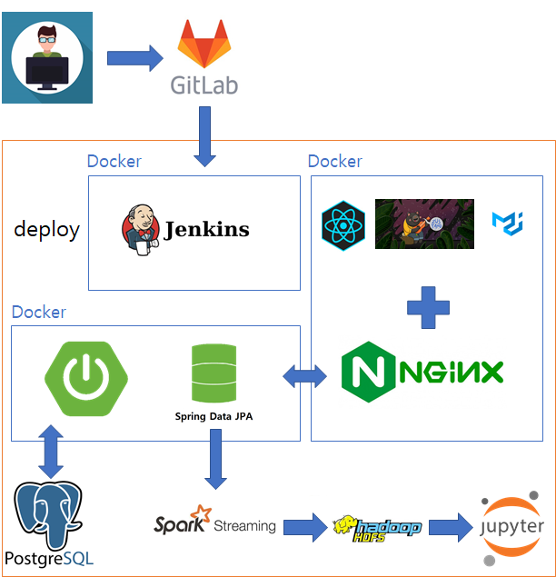

## 감정은 별이 되어 (위치 기반 SNS)

- 빅데이터 - 분산
- 개발 기간: 2022.02.21 ~ 2022.04.08

## 목차

1. 개발 기획
2. 서비스 아키텍처
3. 협업 툴
4. 팀원 소개 및 역할
5. 협업 후기

## 개발 기획

- 빅데이터 분산
- 우선 데이터를 구해야 한다..!
- 혹시, 우리가 빅데이터를 직접 구축할 수 있지 않을까?
- 그렇다면 유저가 데이터를 직접 만드는 환경은 무엇이 있을까?
- **SNS!**
- 다른 특색을 주면서, 데이터도 많이 모으고파..!
- 일반적인 SNS는 글과 사진으로 이루어져 있다
- 기억은 장소와 감정으로 구성된다
- 글, 사진, 장소, 감정 모두를 담을 수 있는 SNS라면 데이터를 많이 구축할 수 있지 않을까..?
- 그래, **위치 기반 SNS**를 만들자..!

## 서비스 아키텍쳐

## 협업 툴

- Gitlab
- Jira
- Notion
- Mattermost
- Webex

## 팀원 소개 및 역할

#### 김주호 : FE, 전체 팀장

> 코로나에도 불구하고 막을 수 없는 개발열정
>
> 처음 다뤄보는 리액트, 열심히 학습하고 사용했다..!

#### 배나영 : BE, BE 팀장

> 

#### 이소라 : BE, 배포 팀장

> 

#### 송진섭 : BE, 분산 팀장

> 

#### 윤동희 : FE, FE 팀장

> 

## 협업 후기

### 김주호

- `React`를 다뤄보고 싶은 마음이 컸고, 그에 따라 최신 기술인 `Zustand`도 같이 적용하고 싶었습니다.
- `아토믹 디자인 패턴`을 활용하여 프로젝트를 구성했으나 제대로 지키지 못 한 것 같아 많이 아쉬웠습니다.
- 팀원도 한 명 부족하였고, 코로나 때문에 제대로 작업할 수 없었으나 서로 믿고 의지하며 잘 이겨냈다고 생각합니다.
- 자율 때 더 성장한 모습을 보여드리고 싶습니다. 부족한 팀장을 군말 없이 따라와준 팀원들에게 정말 고맙다고 얘기하고 싶습니다! 

### 배나영

- 

### 이소라

- 이번 프로젝트를 하면서 CI/CD를 처음 맡아서 배포하게 되었는데, 이번 경험을 통해 Docker와 인프라쪽에 대한 경험이 한층 더 성장한것 같아서 기쁩니다.
- 공통때보다 JPA를 더 자유롭게 사용해 api를 만드는 등 개인의 성장을 이룰 수 있어서 기뻣고 자율프로젝트때 제가 얼마나 성장할 수 있을지 기대됩니다.

### 송진섭

- 

### 윤동희

- 