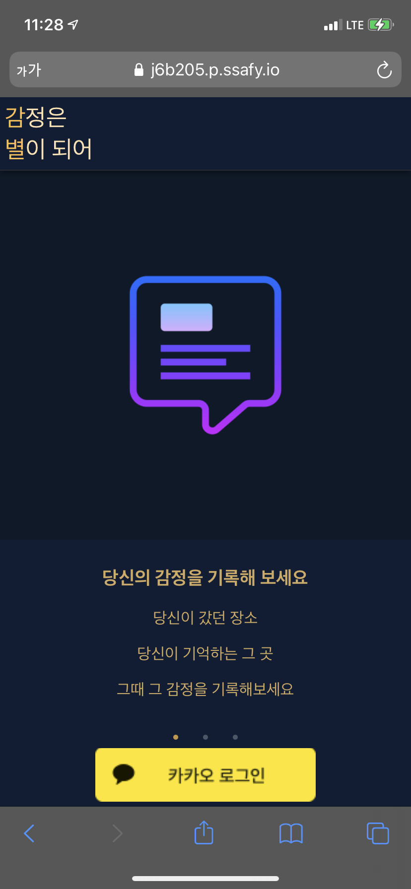
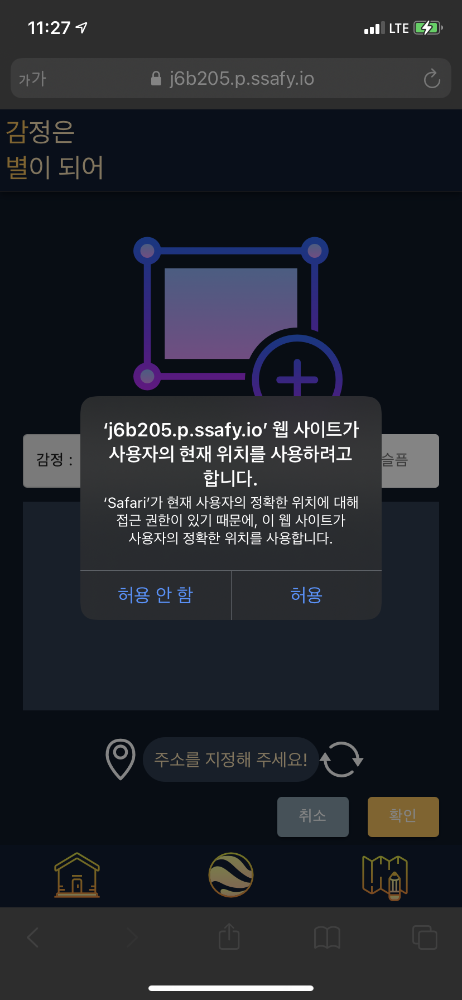
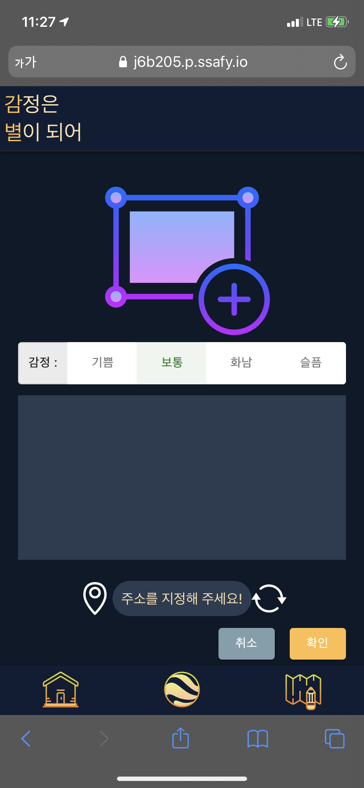
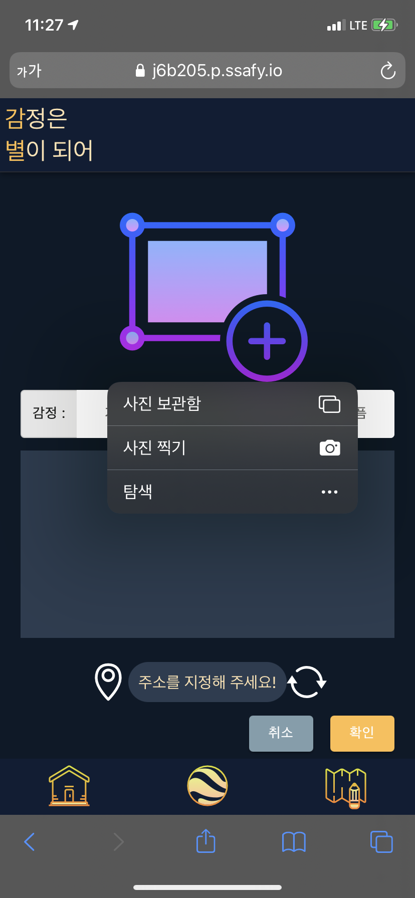
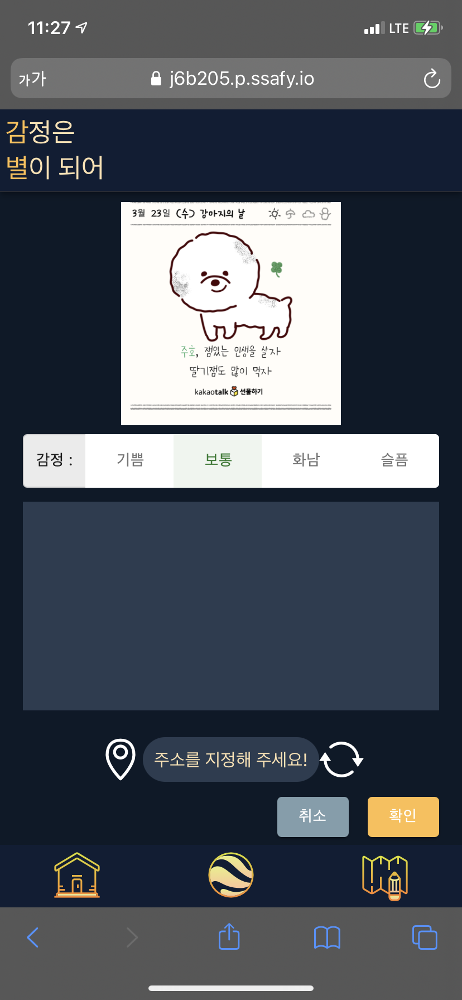
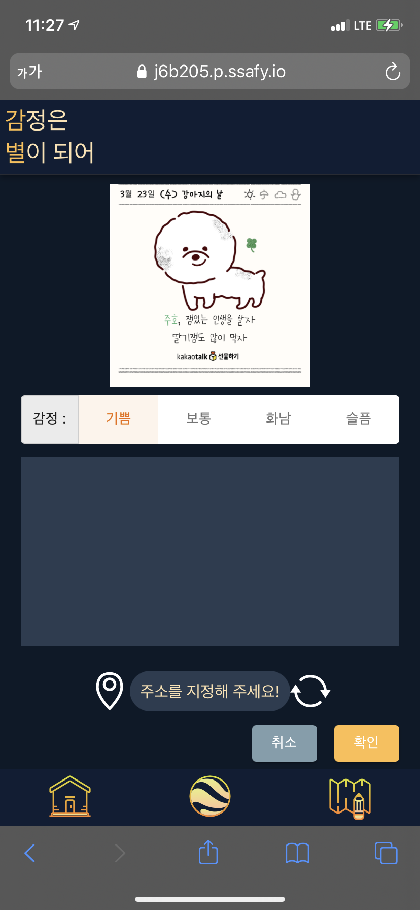
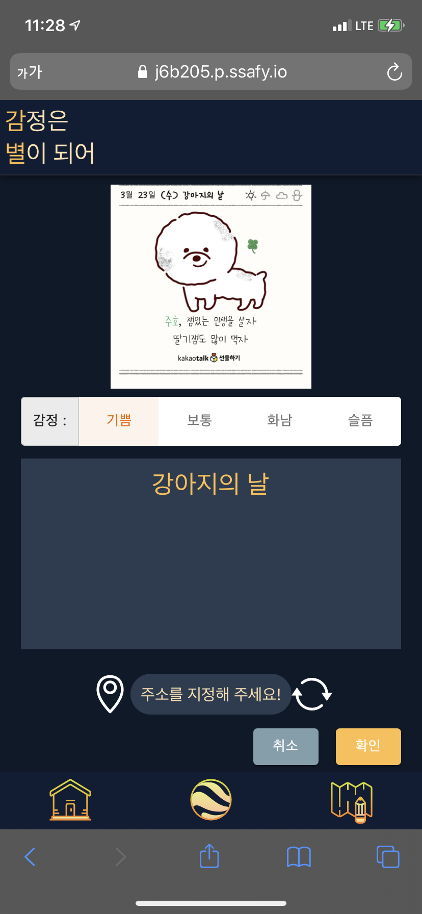
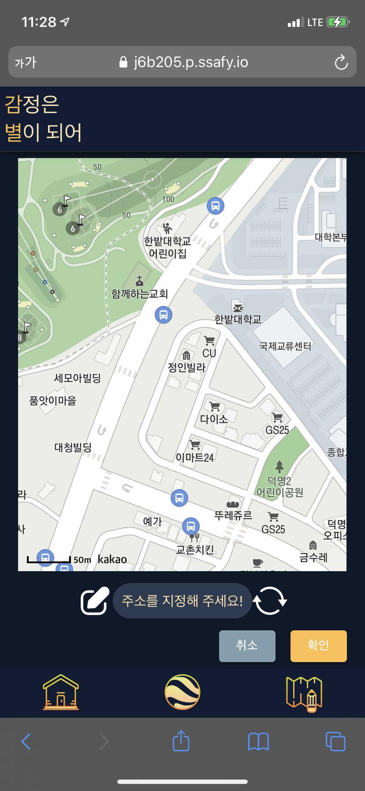
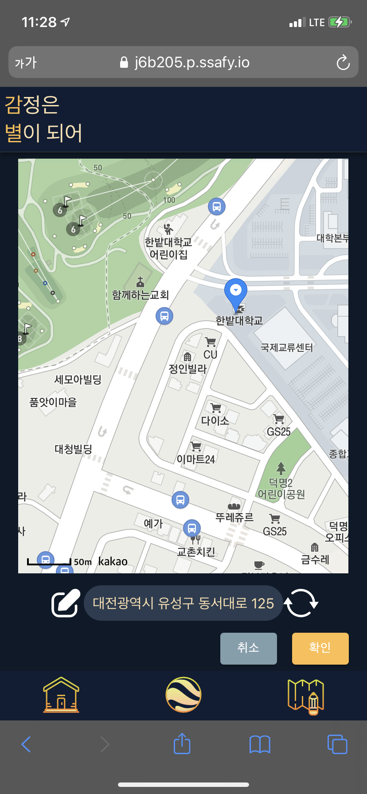
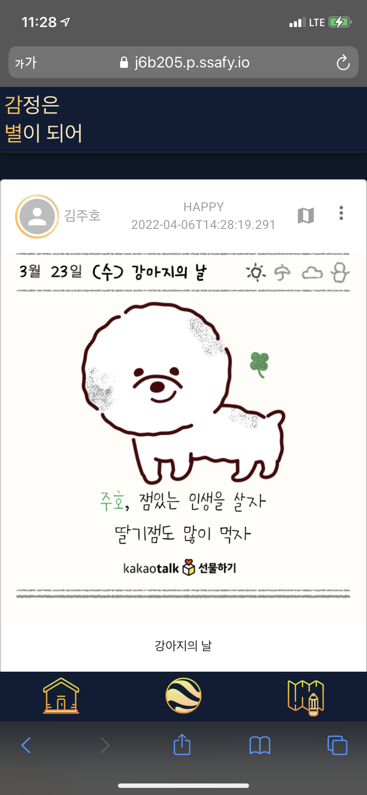

# 포팅 메뉴얼

## 클론 이후 빌드

## 외부 서비스 정보

### 카카오 앱

앱 ID: 718291

앱 이름: 감별

사업자명: 김주호

사이트 도메인: `https://j6b205.p.ssafy.io`(배포), `http://localhost:3000`(로컬)

### 카카오 로그인

Redirect URI: `https://j6b205.p.ssafy.io/kakaocallback`(배포), `http://localhost:3000/kakaocallback`(로컬)

동의 항목: 닉네임, 프로필 사진

### 카카오 지도

카카오 앱 연결

## DB 덤프 파일 최신본

## 시연 시나리오

### 로그인 이전

상단의 소개글은 좌, 우로 슬라이드하여 확인 가능

하단의 '카카오 로그인' 버튼을 누르면, 카카오 제공의 OAuth로 넘어간 후 로그인 데이터를 전달받음

### 로그인 이후

### 글 작성

위치 기반 서비스를 이용하기 때문에, 처음 글 작성 페이지로 넘어오면 위치 사용 문구가 뜬다.

기본적인 형태.

위의 사진 추가를 누르면 보관함 및 사진을 촬영하는 화면으로 전환된다.

원하는 사진을 클릭하면 업로드 및 미리보기가 가능하다. 만약 이미지 파일이 아니라면 경고가 뜨게 된다.

감정을 눌러 바꿀 수 있다.

원하는 텍스트를 작성할 수 있다.

주소 옆 지도 핑 버튼을 누르면 지도 화면으로 전환된다.

원하는 곳을 터치하여 주소를 얻어올 수 있다.

작성한 글은 메인페이지에서 SNS형태로 볼 수 있다.