# 포팅 메뉴얼

## 클론 이후 빌드

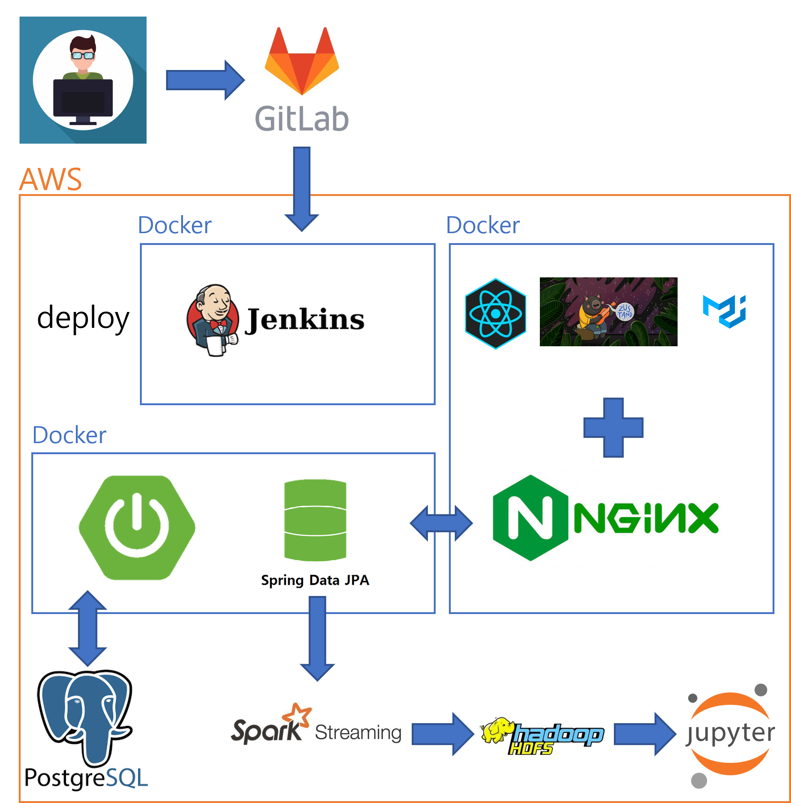

### 진행 상황

백엔드와 프론트 서버가 배포되어 있는 상태로, CICD가 완료되어 있습니다.

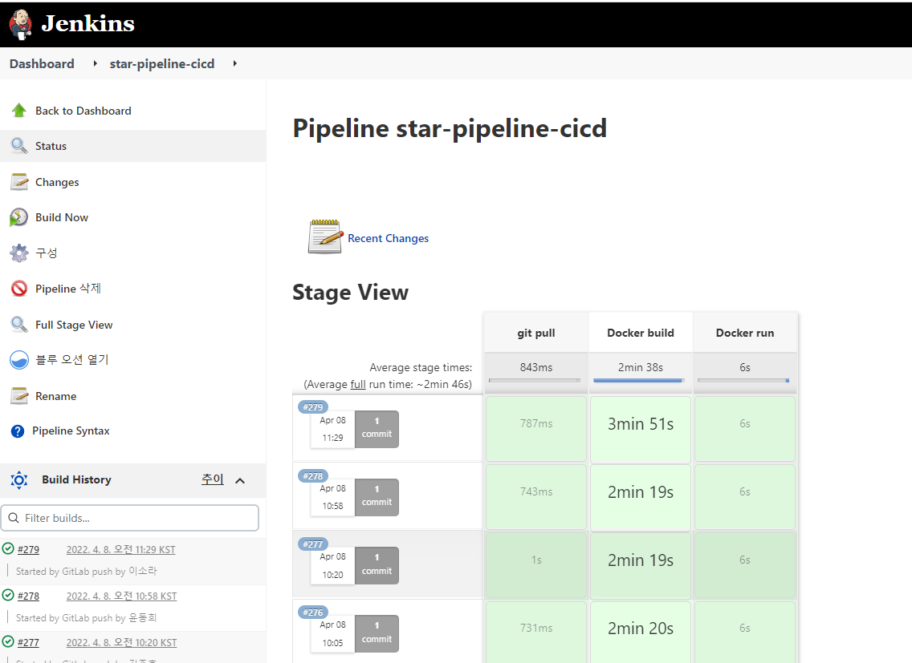

젠킨스를 통해 push된  gitlab 코드를 Doker로 자동빌드/ 자동실행 되도록 구성하였습니다. 

왼측을 보면 Build History를 통해 gitlab의 master 브랜치가 push된 이력을 확인 할 수 있습니다.

오른측은 pipeline을 구축해 서버에 자동 빌드/배포가 어디까지 진행됬는지 확인할 수 있습니다.

### 시스템 구성

- jenkins 2.3
  - blueocean : 지속적 배포와 관리 할 수 있는 UI를 지원합니다.
- docker
- docker-compose - jenkins
- DB 서버 : aws ce2

jenkinsfile은 **Declarative Pipeline** 방식으로 구현했습니다.

jenkins blueocean과 front + nginx, backend 도커 서버로 구축되어 있습니다.

### 주의사항

빌드할 때 시간이 걸립니다(5분정도??) 충돌을 막기 위해 머지할 때 최소 5~10분 정도의 간격을 두고 해야합니다.

## 외부 서비스 정보

### 카카오 앱

앱 ID: 718291

앱 이름: 감별

사업자명: 김주호

사이트 도메인: `https://j6b205.p.ssafy.io`(배포), `http://localhost:3000`(로컬)

### 카카오 로그인

Redirect URI: `https://j6b205.p.ssafy.io/kakaocallback`(배포), `http://localhost:3000/kakaocallback`(로컬)

동의 항목: 닉네임, 프로필 사진

### 카카오 지도

카카오 앱 연결

## DB 덤프 파일 최신본

[userid](./dump/users.csv) 유저정보 개인정보로 인해 user_id만 추출

[star](./dump/star.csv) 작성 글 

[login_user_information](./dump/login_info.csv) 유저 로그인로그 개인정보로 인해 유저ip 제거

[likes](./dump/likes.csv) 좋아요

[follow](./dump/follow.csv) 팔로우

[comment](./dump/comment.csv) 댓글

## 시연 시나리오

### 로그인 이전

상단의 소개글은 좌, 우로 슬라이드하여 확인 가능

하단의 '카카오 로그인' 버튼을 누르면, 카카오 제공의 OAuth로 넘어간 후 로그인 데이터를 전달받음

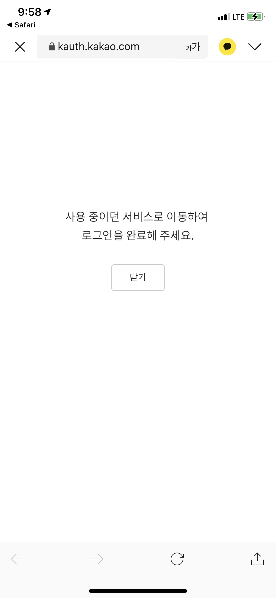

다시 브라우저로 돌아가면 로그인이 되어 있다.

### 로그인 이후

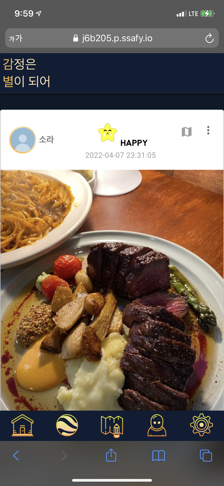

로그인 직후, 모든 글 전체보기로 화면이 전환된다.

### 글 조회

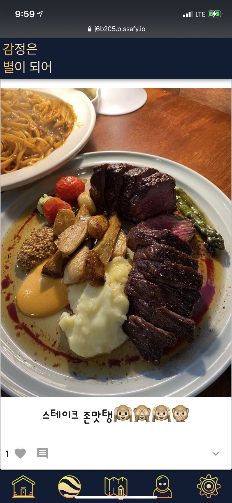

사진, 내용, 좋아요, 댓글 등을 확인할 수 있다.

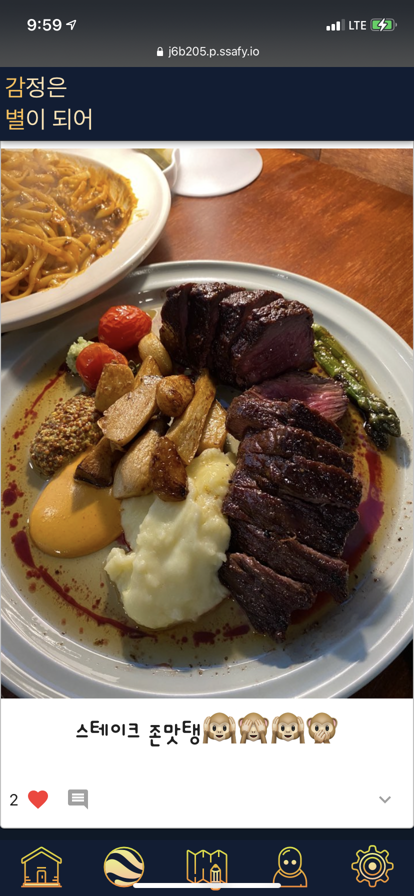

좋아요를 누르면 카운트가 올라간다.

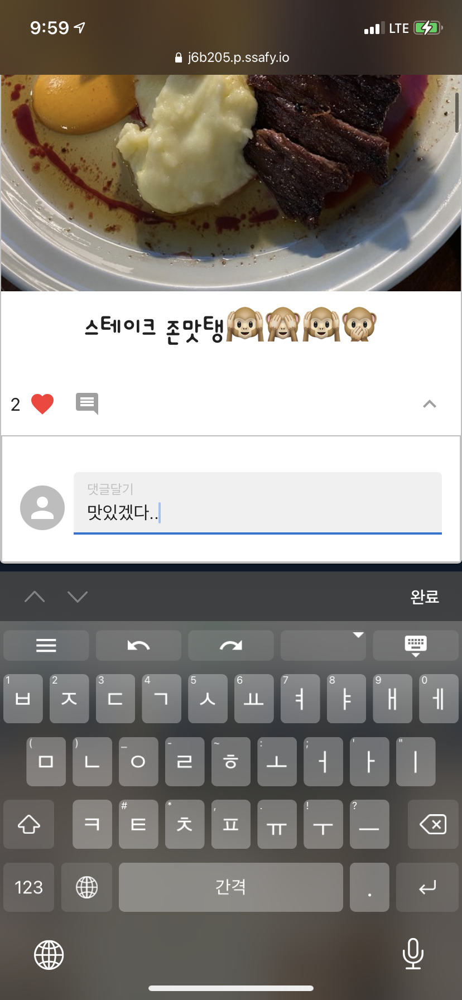

모바일 환경 상 댓글이 길어지면 스크롤을 많이 해야 하기에 가려놓은 상태. 버튼을 눌러 댓글을 확인하고 달 수 있다.

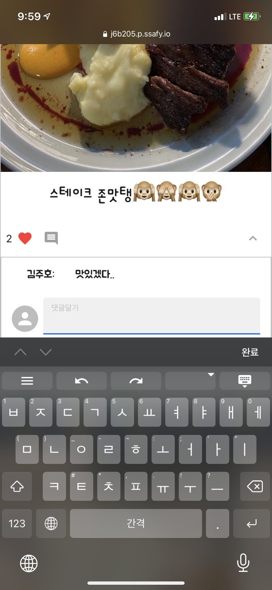

댓글이 작성된 모습.

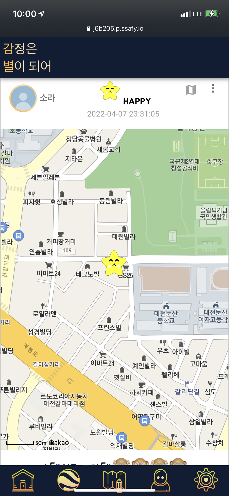

이미지 상단의 지도 버튼을 누르면 어느 위치에서 작성된건지 확인할 수 있다.

### 전체 글 지도 조회

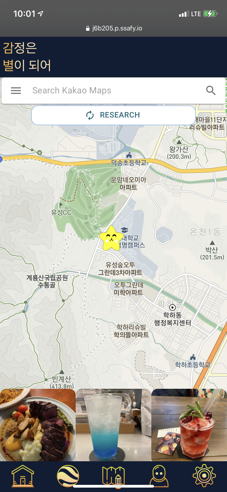

작성된 글들을 위치 기반으로 확인할 수 있다.

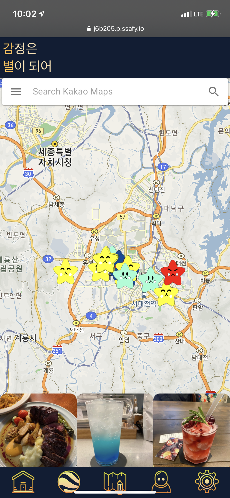

상단에 위치를 검색(ex: 서울)하면 화면이 이동된다.

### 글 작성

위치 기반 서비스를 이용하기 때문에, 처음 글 작성 페이지로 넘어오면 위치 사용 문구가 뜬다.

기본적인 형태.

위의 사진 추가를 누르면 보관함 및 사진을 촬영하는 화면으로 전환된다.

원하는 사진을 클릭하면 업로드 및 미리보기가 가능하다. 만약 이미지 파일이 아니라면 경고가 뜨게 된다.

감정을 눌러 바꿀 수 있다.

원하는 텍스트를 작성할 수 있다.

주소 옆 지도 핑 버튼을 누르면 지도 화면으로 전환된다.

원하는 곳을 터치하여 주소를 얻어올 수 있다.

작성한 글은 메인페이지에서 SNS형태로 볼 수 있다.

### 마이 페이지

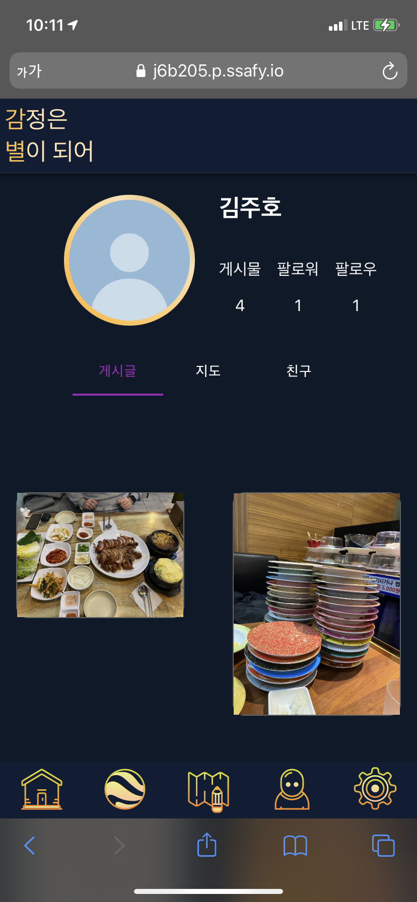

내가 작성한 글들의 사진을 확인할 수 있다.

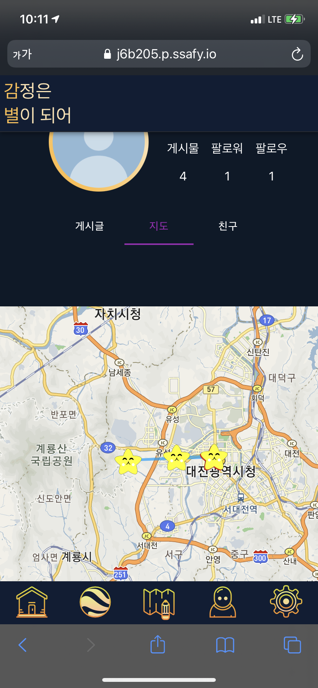

작성한 글들의 별들이 이어져 하나의 별자리가 된다.

다른 사람의 프로필을 누르면 다른 사람의 마이페이지로 갈 수 있다.

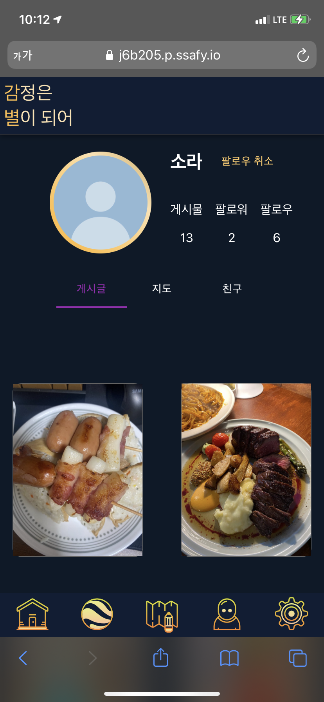

팔로우 버튼이 동작한 모습.

### 통계

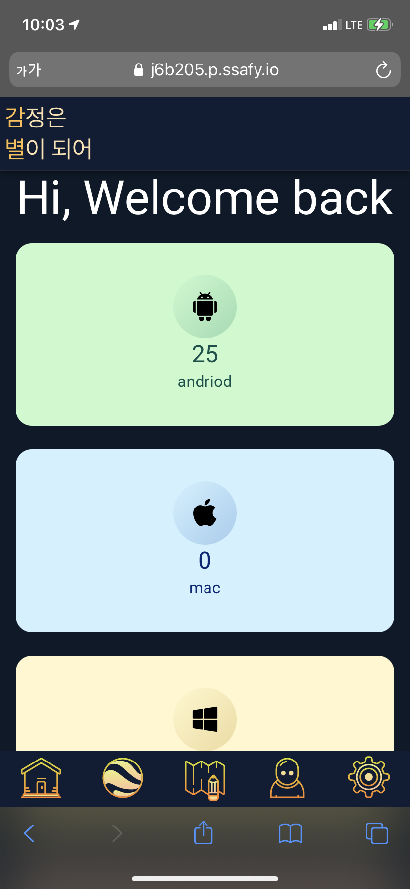

접속한 유저들의 통계를 확인할 수 있다.

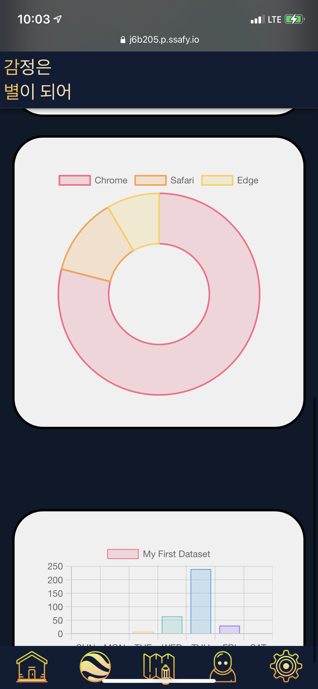

접속 브라우저 등.