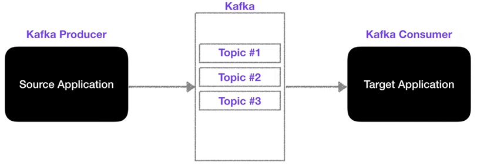
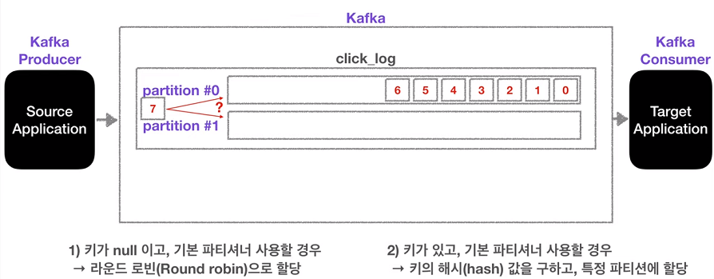

# Apache Kafka

[TOC]

**`강의` 아파치 카프카 | 데이터💾가 저장되는 토픽에 대해서 알아봅시다.**

## 카프카 Topic은 무엇인가?

카프카에는 다양한 데이터가 들어갈 수 있는데 그 데이터가 들어가는 공간을 Topic이라고 말함.

이 카프카 토픽은 AMQP와는 다소 다르게 동작함

카프카에서는 토픽을 여러 개 생성할 수 있다. 

토픽은 데이터베이스의 테이블이나 파일 시스템의 폴더와 유사한  성질을 가지고 있는데 이 토픽에 Producer가 데이터를 넣게 되고 Consumer가 데이터를 가져가게 된다.

토픽은 이름을 가질 수 있어, 목적에 따라 클릭로그, send sms, location log 등과 같이 무슨 데이터를 담는지 명확하게 명시하면 추후 유지보수 시 편리하게 관리할 수 있다.

 

### Kafka Topic내부

하나의 토픽은 여러 개의 파티션으로 구성될 수 있으며, 첫번째 파티션 번호는 0번부터 시작한다.
하나의 파티션은 queue와 같이 내부에 데이터가 파티션 끝에서부터 차곡차곡 쌓이게 된다.

클릭로그 Topic에 Kafka Consumer가 붙게 되면 데이터를 가장 오래된 순서대로 가져가게 된다. (0번부터 가져간다는 뜻)
더이상 데이터가 들어오지 않으면 Consumer는 또 다른 데이터가 들어올때까지 기다린다.
이 때 Consumer가 토픽 내부의 파티션에서 데이터를 가져가도 데이터는 삭제되지 않고 파티션에 그대로 남아 있다.
→ **Consumer Group이 달라야 하고 auto.offset.reset=earliest로 셋팅**되어 있는 경우, 새로운 Consumer가 붙었을 때 다시 0번부터 가져가서 사용할 수 있다.

이처럼 사용할 경우 동일 데이터에 대해서 두번 처리할 수 있는데 이는 카프카를 사용하는 아주 중요한 이유이기도 합니다.

위 그림처럼 클릭로그를 분석하고 시각화하기 위해 엘라스틱서치에 저장하기도 하고 클릭로그를 백업하기 위해 하둡에 저장할 수도 있다.

이제 파티션이 2개 이상인 경우
데이터 7이 토픽에 들어가야 하는데 어느 파티션에 들어가야 할까?
프로듀서가 데이터를 보낼 때 키를 지정할 수 있다.
만약 키가 null, 즉 키를 지정하지 않고 기본 파티셔너 설정을 사용한다면 round-robin으로 파티션이 지정된다.
만약 키가 있고, 기본 파키셔너를 사용할 경우 키의 해시값을 구하고 특정 파티션에 항상 할당되게 된다.

이번 경우에는 key를 따로 설정하는 것을 가정하지 않았으므로 데이터 7은 파티션1번에 들어가게된다.
그리고 round-robin으로 데이터가 파티션에 나눠져서 들어가게 된다.

파티션을 늘리는 것은 가능하지만 다시 줄일 수 없기 때문에 파티션을 늘리는 것은 아주 조심해야 한다.

#### 파티션을 늘리는 이유는?

파티션을 늘리면 컨슈머의 개수를 늘려서 데이터 처리를 분산시킬 수 있다.

#### 이렇게 데이터가 늘어나면 파티션의 데이터는 언제 삭제될까?

삭제되는 타이밍은 옵션에 따라 다르다.
레코드가 저장되는 최대 시간과 크기를 지정할 수 있다.
이를 지정하게 되면 일정한 기간 혹은 용량동안 데이터를 저장할 수 있게 되고 적절하게 데이터가 삭제될 수 있도록 설정할 수 있다.

 

 

## Kafka Architecture

**Broker** : Kafka를 구성하는 각 서버 1대 = 1 broker

**Topic** : Data가 저장되는 곳

**Producer** : Broker에 data를 write하는 역할

**Consumer** : Broker에서 data를 read하는 역할

**Consumer-Group** : 메세지 소비자 묶음 단위(n consumers)

**Zookeeper** : Kafka를 운용하기 위한 Coordination service([zookeeper 소개](http://bcho.tistory.com/1016))

**Partition** : topic이 복사(replicated)되어 나뉘어지는 단위

 

 

### Kafka 데이터 쓰기, 복제, 저장

Producer는 1개이상의 partition에 나뉘어 데이터를 write한다.
상기 partition에 적힌 번호는 각 partition의 offset번호임.

각 Topic의 partition은 1개의 Leader Replica + 0개 이상의 follower Replica로 구성

→ Leader Replica에 데이터를 write, 다른 broker에 follower replica로 복제

→ Topic의 데이터(log) 중 replica 데이터는 log segment라는 파일(disk)에 기록

→ 메모리가 남아 있으면 페이지 캐시 사용

 

 

### Kafka 데이터 읽기

Consumer는 Partition단위로 데이터를 병렬로 읽을 수 있음

→ 복수의 Consumer로 이루어진 Consumer group을 구성하여 1 topic의 데이터를 분산하여 처리 가능

→ **Topic partition number >= Consumer Group number** 일 경우만 가능

  (Topic partition number < Consumer Group number일 경우 1개 이상의 consumer는 유휴 상태가 됨)

 

 

## 참고자료

[아파치 카프카 | 데이터💾가 저장되는 토픽에 대해서 알아봅시다.](https://www.youtube.com/watch?v=7QfEpRTRdIQ&amp;list=PL3Re5Ri5rZmkY46j6WcJXQYRlDRZSUQ1j&amp;index=2)

[빅 데이터 처리를 위한 아파치 Kafka 개요 및 설명](https://blog.voidmainvoid.net/179)

